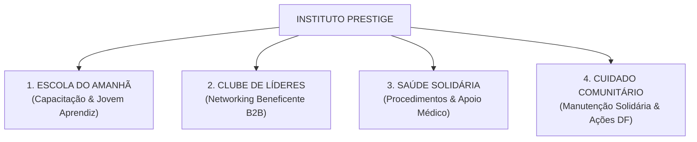

# Projeto: Instituto Prestige (Braço Social, ESG & Networking de Impacto)

> **Status:** Ideia Estratégica em Planejamento  
> **Idealizador:** Rodrigo Brandão / Prestige Auto Spa  
> **Propósito Central:** Cuidar de pessoas e da comunidade com a mesma dedicação com que a Prestige cuida do patrimônio dos seus clientes. Gerar transformação social genuína, formando jovens, apoiando quem precisa de saúde/emprego e criando uma rede de networking empresarial de alto impacto.

---

## 🎯 1. Visão Geral e Filosofia do Projeto

A Prestige Auto Spa nasceu com foco em transparência, excelência técnica e relações humanas de confiança. O **Instituto Prestige** é a extensão natural desse posicionamento: uma iniciativa sem fins lucrativos que conecta a estrutura da empresa, seus clientes influentes (empresários, médicos, profissionais liberais e servidores públicos do DF) e a comunidade vulnerável.

### O Efeito de Crescimento Orgânico (Por que gera valor a longo prazo)
Embora a motivação seja 100% humanitária e sem foco financeiro direto, iniciativas sociais estruturadas geram retorno orgânico sustentável através de quatro forças:

1. **Brand Equity & Confiança Moral (ESG Autêntico):** Consumidores das classes A e B preferem marcas que geram impacto real na comunidade local.
2. **Formação e Retenção de Mão de Obra:** O maior gargalo do setor automotivo é encontrar profissionais qualificados e confiáveis. A escola profissionalizante do Instituto treina jovens com a cultura e o padrão de excelência da Prestige desde o primeiro dia.
3. **Networking B2B de Alto Valor ("Conexão por Propósito"):** Empresários e líderes do DF se unem em torno de causas sociais, criando laços de confiança que naturalmente deságuam em frotas corporativas, contratos comerciais e clientes fiéis.
4. **Mídia Espontânea (Earned Media):** Ações sociais bem executadas atraem cobertura de veículos de imprensa (TVs locais, portais do DF, jornais) sem necessidade de investimento em anúncios.

---

## 🏛️ 2. Os 4 Pilares de Atuação do Instituto

---

### Pilar 1: Escola do Amanhã (Formação de Jovens & Empregabilidade)
* **Público:** Jovens de 16 a 24 anos em situação de vulnerabilidade social no DF.
* **Formatos de Curso:**
  * *Módulo Estética Automotiva:* Lavagem técnica, polimento, higienização, cuidados com couro e proteção de superfícies.
  * *Módulo Mecânica Básica e Diagnóstico:* Troca de fluidos, alinhamento/balanceamento, revisão preventiva e leitura de scanner.
  * *Módulo Comportamental & Atendimento ao Cliente:* Ética, pontualidade, comunicação clara e postura profissional.
* **Encaminhamento de Carreira:**
  * Contratação dos melhores alunos como **Jovens Aprendizes** ou estagiários na própria Prestige.
  * Encaminhamento com carta de recomendação oficial para lojistas, concessionárias parceiras e oficinas da rede de contatos da Prestige.

---

### Pilar 2: Clube de Líderes & Networking de Impacto ("Café com Propósito")
* **Conceito:** Utilizar a base qualificada de clientes da Prestige (empresários, executivos, médicos e advogados) para formar um comitê voluntário de apoio social.
* **Formato:** Encontros bimestrais de networking na recepção/lounge da Prestige ou em locais parceiros ("Café com Propósito Prestige").
* **Dinâmica:**
  * Rodada rápida de networking e troca de oportunidades entre os empresários.
  * Apresentação dos casos sociais atendidos pelo Instituto no período.
  * Adoção de causas (ex: empresários oferecendo vagas de emprego para os jovens formados, doações para tratamentos de saúde ou apadrinhamento de cursos).

---

### Pilar 3: Saúde Solidária (Procedimentos Médicos & Odontológicos)
* **Problema:** Milhares de pessoas aguardam meses ou anos no SUS para procedimentos simples que devolveriam sua dignidade ou capacidade de trabalhar (ex: cirurgia de catarata, procedimentos odontológicos, exames diagnósticos, pequenas cirurgias ortopédicas).
* **Solução Prestige:**
  * Parceria solidária com médicos, clínicas, dentistas e laboratórios que são clientes ou parceiros da Prestige.
  * O Instituto Prestige viabiliza a triagem, custos de insumos ou logística, enquanto os profissionais voluntários doam horas de atendimento/procedimento.
  * Caso a caso acompanhado com total transparência e prestação de contas.

---

### Pilar 4: Cuidado Comunitário & Ações Sociais Locais
* **Oficina Solidária:** Revisão e manutenção preventiva gratuita para veículos de instituições beneficentes do DF (ambulâncias de ONGs, vans de transporte de pacientes oncológicos, carros de lares de idosos ou creches).
* **Ponto de Coleta Permanente na Unidade:** Caixas personalizadas e sofisticadas na recepção da Prestige para arrecadação de agasalhos no inverno, alimentos não-perecíveis e material escolar no início do ano letivo.

---

## 📊 3. Dados de Mercado & Referências Inspiradoras

### Dados de Impacto e Tendência ESG
* **Prefeência de Consumo:** Segundo pesquisa da *Cone Communications / Harvard Business Review*, **87% dos consumidores afirmam que preferem comprar produtos e serviços de empresas que defendem questões sociais**, e **76% se recusam a fazer negócios** com marcas que demonstram descaso social.
* **Empregabilidade Jovem:** No Brasil, a taxa de desocupação entre jovens de 18 a 24 anos é mais que o dobro da média nacional (IBGE). Projetos de capacitação técnica em serviços especializados (como estética automotiva e mecânica leve) têm taxa de absorção de mercado superior a 70%.
* **Retenção de Talentos:** Empresas que possuem programas sociais estruturados reduzem o turnover interno de colaboradores em até 35%, pois os funcionários sentem orgulho de pertencer à organização.

### Referências e Benchmarks de Sucesso
1. **Fundação Porto Seguro (Brasil):** Referência do setor automotivo e segurador. Criou centros de formação profissionalizante em mecânica e funilaria para jovens de periferia, abastecendo as oficinas credenciadas e gerando uma das marcas mais respeitadas do país.
2. **Instituto Ayrton Senna:** Demonstração máxima de como a paixão automotiva pode se converter em transformação educacional e social de larga escala.
3. **Mecanicando / Projetos Locais de Cidadania:** Oficinas-escola que transformam apaixonados por carros em profissionais certificados, tirando jovens da ociosidade e gerando renda imediata.

---

## 🚀 4. Roteiro de Implementação em 3 Fases

### Fase 1: Validação & Primeiras Ações Piloto (Próximos 3 a 6 meses)
- [ ] Criar o ponto de arrecadação física no lounge da Prestige em Brasília (ex: Campanha de Material Escolar ou Dia das Crianças).
- [ ] Selecionar a primeira instituição beneficente do DF para realizar a revisão preventiva gratuita da sua van/veículo de apoio na oficina da Prestige.
- [ ] Formar o primeiro piloto do programa **Jovem Aprendiz Prestige** (contratação e treinamento prático de 1 a 2 jovens da comunidade).
- [ ] Divulgar os bastidores e os resultados no Instagram (@prestigeautospaof) com foco em humanização e agradecimento aos clientes que tornam isso possível.

### Fase 2: Comitê de Networking & Parcerias de Saúde (6 a 12 meses)
- [ ] Realizar a 1ª edição do "Café com Propósito Prestige" para os 15 principais clientes empresários e profissionais de saúde.
- [ ] Mapear médicos e clínicas parceiras dispostas a adotar 1 procedimento/consulta solidária por mês.
- [ ] Criar a primeira turma da **Oficina-Escola Prestige** (aulas práticas aos sábados à tarde na unidade).

### Fase 3: Formalização & Expansão (12 a 24 meses)
- [ ] Estruturar a personalidade jurídica do Instituto (Associação sem fins lucrativos ou OSCIP) com governança transparente.
- [ ] Expandir o modelo para a futura unidade de Maceió-AL e outras praças da rede.
- [ ] Lançar o selo "Empresa Amiga do Instituto Prestige" para as empresas parceiras que contratarem jovens do programa ou financiarem bolsas.

---

## 📝 5. Próximos Passos Imediatos
1. Discutir com o Erick (presencial em Brasília) para mapear ONGs e instituições locais que possuem vans ou carros precisando de manutenção.
2. Criar uma identidade visual limpa e conectada para o **Instituto Prestige** (monograma Prestige com elemento de acolhimento em dourado e branco).
3. Redigir um manifesto institucional curto sobre o Instituto para apresentar a parceiros e clientes no lounge da unidade.
